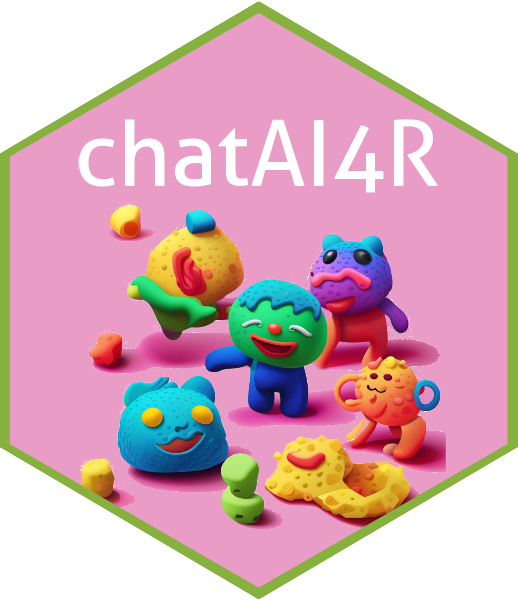

# chatAI4R 

<!-- badges: start -->
[](https://cran.r-project.org/package=chatAI4R)
<!-- badges: end -->

## Description

**chatAI4R**, **Chat-based Interactive Artificial Intelligence for R**, is an R package designed to integrate the OpenAI API and other APIs for artificial intelligence (AI) applications. This package leverages large language model (LLM)-based AI techniques, enabling efficient knowledge discovery and data analysis. In addition, this package includes functionality for performing image generation such as txt2img and img2img using the DALL·E 2 and Stable Diffusion APIs. Indeed, chatAI4R provides basic R functions for using LLM and a set of R functions to support the creation of prompts for using LLM.

chatAI4R is an experimental project aimed at developing and implementing various LLM applications in R. Furthermore, the package is under continuous development with a focus on extending its capabilities for bioinformatics analysis.

## About this project and future developments

- AI integration with R
  - OpenAI API (ChatGPT, txt2img, text embeddings, DALL·E 2)
  - DeepL API
  - DreamStudio API (Stable Diffusion, txt2img, img2img, up-scaling/Super-resolution)

- LLM-based data analysis
  - Automated Analysis: Analysis Design, Statistics, Data Visualization, Discussion, Question Answering
  - Highly-technical texts modeling and natural language question answering
  - Bioinformatics analysis (future developments)
  
## Installation of the chatAI4R package

### 1. Start R / RStudio console.

### 2. Run the following commands in the R console:

```r
# CRAN-version installation (Not yet available)
install.packages("BiocManager", repos="http://cran.r-project.org")
BiocManager::install("EBImage")

install.packages("chatAI4R")
library(chatAI4R)

# Dev-version installation
install.packages(c("devtools", "BiocManager"), repos="http://cran.r-project.org")
BiocManager::install("EBImage")

devtools::install_github("kumeS/chatAI4R")
library(chatAI4R)

#For MacOS X, installation from source: Recommended
system("wget https://github.com/kumeS/chatAI4R/archive/refs/tags/v0.0.4.tar.gz")
system("R CMD INSTALL chatAI4R-0.0.4.tar.gz")
```

### 3. Set the API key according to each Web API.

For example, to obtain an OpenAI API key, please register as a member on the OpenAI website (https://platform.openai.com/account/api-keys) and obtain your API key.

```r
#Set your key for the OpenAI API
Sys.setenv(OPENAI_API_KEY = "Your API key")

#Set your key for the DeepL API
Sys.setenv(DeepL_API_KEY = "Your API key")

#Set your key for the DreamStudio API
Sys.setenv(DreamStudio_API_KEY = "Your API key")
```

## Tutorial

### Basic usage

- [Usage of functions in the chatAI4R package](https://kumes.github.io/chatAI4R/inst/vignettes/HowToUse.html)

###  Applied usage of the chatAI4R package

- AI-based chatting loaded with highly-technical documents (RIKEN Pressrelease text)

## R functions

Flowcharts of the R functions were created by GPT-4 + Skrive plugin.

### Basic functions

|Function|Description|Script|Flowchart|
|:---|:---|:---:|:---:|
|chat4R|Chat4R: Interact with GPT-3.5 (default) using OpenAI API (One-shot)|[Script](https://github.com/kumeS/chatAI4R/blob/main/R/chat4R.R)|[Flowchart](https://github.com/kumeS/chatAI4R/blob/main/inst/flowchart/chat4R.png)|
|chat4R_history|Use chat history for OpenAI's GPT model|[Script](https://github.com/kumeS/chatAI4R/blob/main/R/chat4R_history.R)|[Flowchart](https://github.com/kumeS/chatAI4R/blob/main/inst/flowchart/chat4R_history.png)|
|completions4R|Generate text using OpenAI completions API (One-shot)|[Script](https://github.com/kumeS/chatAI4R/blob/main/R/completions4R.R)|[Flowchart](https://github.com/kumeS/chatAI4R/blob/main/inst/flowchart/completions4R.png)|
|textEmbedding|Text Embedding from OpenAI Embeddings API (model: text-embedding-ada-002)|[Script](https://github.com/kumeS/chatAI4R/blob/main/R/textEmbedding.R)|[Flowchart](https://github.com/kumeS/chatAI4R/blob/main/inst/flowchart/textEmbedding.png)|
|deepel|DeepL Translation Function|[Script](https://github.com/kumeS/chatAI4R/blob/main/R/deepel.R)|[Flowchart](https://github.com/kumeS/chatAI4R/blob/main/inst/flowchart/deepel_v2.png)|
|slow_print|Slowly Print Text||[Script](https://github.com/kumeS/chatAI4R/blob/main/R/slow_print.R)|Flowchart|


### Secondary Layer Functions

|Function|Description|Script|Flowchart|
|:---|:---|:---:|:---:|
|conversation4R|Manage a conversation using a chatting history|[Script](https://github.com/kumeS/chatAI4R/blob/main/R/conversation4R.R)|[Flowchart](https://github.com/kumeS/chatAI4R/blob/main/inst/flowchart/conversation4R.png)|
|createFunction4R|Generate and improve R functions (experimental)|Script|Flowchart|
|TextSummary| Summarize a long text (experimental)|Script|Flowchart|

### Image generation functions using DALL·E 2  

- generateImage4R
- editImage4R
- imageVariation4R
- createImagePrompt_v1
- createImagePrompt_v2

### Image generation functions using Stable Diffusion

- txt2img_StableDiffusion4R
- img2img_StableDiffusion4R
- img2img_upscale_StableDiffusion4R

### Visualization functions

|Function|Description|Script|Flowchart|
|:---|:---|:---:|:---:|
|Display|Display images and optionally write them into image files|Script|Flowchart|
|createHEX|Create Hex Stickers for R Packages (experimental)|[Script](https://github.com/kumeS/chatAI4R/blob/main/R/createHEX.R)|[Flowchart](https://github.com/kumeS/chatAI4R/blob/main/inst/flowchart/createHEX.png)|
|DisplayAsMovie|Display Images as a Movie|[Script](https://github.com/kumeS/chatAI4R/blob/main/R/DisplayAsMovie.R)|Flowchart|

### Functions for RIKEN press release (future developments)

get_riken_pressrelease_urls: Get URLs of RIKEN Press Releases
riken_pressrelease_text_jpn: Extract text from RIKEN press-release (Japanese)
riken_pressrelease_textEmbedding: Extract text and perform text embedding from RIKEN press-release

## Simple usage

### One-Shot Chatting

All runs using the chat4R function are One-Shot Chatting. Conversation history is not carried over to the next conversation.

```r
#Set your API key
Sys.setenv(OPENAI_API_KEY = "Your API key")

#API: "https://api.openai.com/v1/chat/completions"
chat4R("Hello")

#API: "https://api.openai.com/v1/completions"
completions4R("Hello")
```

### Few-Shots/Chain-Shots Chatting

Executions using the conversation4R function will keep a history of conversations. The number of previous messages to keep in memory defaults to 2.

```r
#Set your API key
Sys.setenv(OPENAI_API_KEY = "Your API key")

#First shot
conversation4R("Hello")

#Second shot
conversation4R("Hello")
```

### Text Embedding

Converts input text to a numeric vector. The model text-embedding-ada-002 results in a vector of 1536 floats.

```r
#Set your API key
Sys.setenv(OPENAI_API_KEY = "Your API key")

#Embedding
textEmbedding("Hello, world!")
```

## License

Copyright (c) 2023 Satoshi Kume. Released under the [Artistic License 2.0](http://www.perlfoundation.org/artistic_license_2_0).

## Cite

Kume S. (2023) chatAI4R: Chat-based Interactive Artificial Intelligence for R.

```
#BibTeX
@misc{Kume2023chatAI4R,
  title={chatAI4R: Chat-based Interactive Artificial Intelligence for R},
  author={Kume, Satoshi}, year={2023},
  publisher={GitHub}, note={R Package},
  howpublished={\url{https://github.com/kumeS/chatAI4R}},
}
```

## Contributors

- Satoshi Kume
