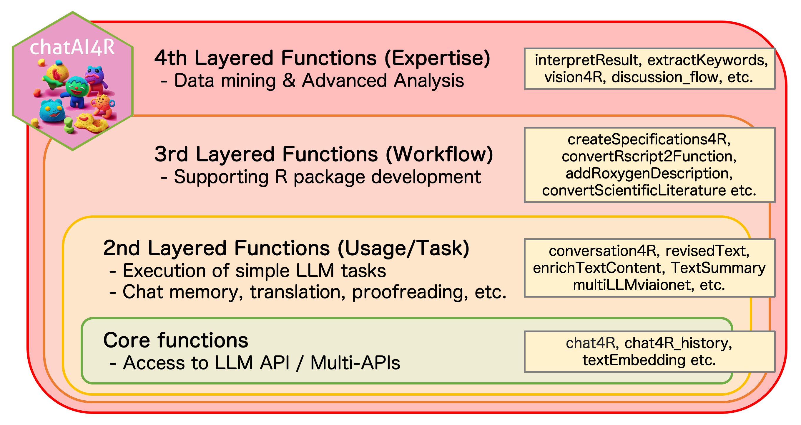

# Summary

Large Language Models (LLMs) have revolutionized natural language processing (NLP), data mining, and program coding. The chatAI4R package provides a comprehensive toolkit for seamlessly integrating LLMs within R environments. Beyond basic text generation and conversation capabilities, it supports text embeddings and delivers sophisticated LLM assistance through simple function calls, significantly extending R-based data analysis and knowledge discovery processes. Unlike existing R packages, the chatAI4R package offers unique R package development support features. Rather than functioning as a multi-functional API wrapper, it provides comprehensive development automation and AI-assisted data mining capabilities. The package combines command-line and graphical operations, offering flexibility for users across all skill levels. Available on both GitHub and the Comprehensive R Archive Network (CRAN), chatAI4R ensures stability, reliability, and broad community accessibility.

Originally a development aid for R packages since 2023, chatAI4R has evolved into a data-analysis companion by adding interpretation, knowledge extraction, and multi-LLM capabilities. It serves R package developers (automating Roxygen2 docs, function generation, code quality) and data analysts (statistical interpretation, literature processing, insight extraction) with a four-layer architecture that goes beyond multi-functional API wrappers.

# State of the Field

Since GPT-4's release [@openai2024gpt4technicalreport], LLMs have rapidly evolved, transforming NLP, data analysis, and programming approaches. While chat-based interfaces offer intuitive experiences, they are insufficient for complex analytical tasks requiring multi-step processing and statistical integration. Current AI agents still suffer from response time limitations in their speculative processing, which makes them unsuitable for iterative workflows. Therefore, direct programmatic access through R becomes essential, leveraging its rich statistical ecosystem and creating a need for specialized R packages that provide efficient LLM integration for data science applications.

The R ecosystem now includes several LLM-focused packages with distinct approaches. For comprehensive LLM integration, ellmer [@Wickham2025] provides wide provider support with advanced features including streaming outputs, tool calling, and structured data extraction. Basic API access is offered by packages like openai (comprehensive but now archived) [@Iegor2024] and gptr [@Wanjun2024], which provides a simple interface through its get_response() function for straightforward ChatGPT interactions.

For local LLM deployment, both ollamar [@Lin2025] and rollama [@gruber2024rollamarpackageusing] facilitate integration with Ollama, an open-source framework for running local LLMs, enabling private and reproducible model execution focused on text annotation and document embedding capabilities.

Development-focused packages include chatgpt [@Rodriguez2023] and gptstudio [@Nivard2024], both providing RStudio addins for coding assistance. While chatgpt focuses specifically on OpenAI integration with features like code commenting, auto-completion, and Roxygen2 documentation generation, gptstudio [@Nivard2024] offers broader provider support through a unified interface.

While these existing tools provide valuable functionality, they primarily serve as API wrappers or development assistants, leaving significant gaps in comprehensive R-specific package development support and integrated data analysis workflows. These limitations create an opportunity for a more comprehensive solution that chatAI4R aims to address.

# Statement of need

While existing R packages provide basic LLM functionality, critical gaps remain in comprehensive R-specific package development support and integrated data analysis workflows. Current tools serve as general-purpose API wrappers without addressing complex analytical needs.

chatAI4R addresses these limitations through its unique multi-layered conceptual architecture, providing a comprehensive ecosystem for LLM integration specifically designed for R users. The package supports nine LLM API platforms through unified interfaces, including OpenAI GPT models and Google Gemini, and provides innovative access to 18 models simultaneously via io.net's Intelligence API (<https://io.net/>, as of 14-JAN-2026), a cloud platform that provides distributed GPU computing resources, enabling access to state-of-the-art open-source models such as gpt-oss-120b, DeepSeek-R1, Qwen3, and Llama-4.

The package's core innovation lies in R-specific package development automation. Beyond basic text generation, chatAI4R offers automated R code generation through `createRfunction()`, intelligent comment addition via `addCommentCode()`, automatic Roxygen2 documentation (R's standard documentation format) with `addRoxygenDescription()`, and comprehensive package architecture planning through `designPackage()`, which assists in proposing the overall design and architecture of an R package. These capabilities transform LLMs into powerful development assistants tailored for R programming workflows.

A distinctive feature is the multi-agent discussion system (`discussion_flow_v1()`), where three specialized AI agents—the Beginner Bot, the Expert Bot, and the Peer Reviewer Bot—collaborate through Socratic dialogue (an iterative question-and-answer methodology). This approach enables iterative solution refinement with human intervention at critical decision points, addressing the single-shot interaction limitations present in existing tools.

The chatAI4R package excels in data analysis interpretation through the `interpretResult()` function, providing specialized interpretation for multiple analysis types including PCA and regression. This feature bridges the gap between statistical output and scientific interpretation, a capability that is absent in current R-LLM packages.



The package maintains production-level reliability through CRAN distribution, ensuring multi-platform compatibility and rigorous testing. Its open-source nature under the Artistic License 2.0 promotes community contribution while maintaining professional development practices.

# Design

The chatAI4R package implements a four-layered application architectural design that provides progressive functionality. This modular approach ensures accessibility for all users.

The Core Functions (Layer 1) establish unified API interfaces for nine LLM platforms. The `chat4R()`, `gemini4R()`, and `multiLLMviaionet()` functions provide standardized access patterns while handling authentication, rate limiting, and error management.

The Advanced Functions (Layer 2) introduce R-specific capabilities through intelligent prompt engineering. The `interpretResult()` function employs specialized templates for 13 analysis types, automatically generating domain-appropriate interpretations.

The Workflow Functions (Layer 3) implement the multi-agent collaboration system. The `discussion_flow_v1()` and `discussion_flow_v2()` architectures employ role-based prompt engineering where each agent maintains distinct personas, enabling iterative solution refinement.

The Integration Functions (Layer 4) provide connectivity with R ecosystem tools and development workflows. This layer facilitates the deployment of R-based web APIs by combining `chatAI4R` with the `plumber` package, allowing users to implement LLM-powered backend processing embedded in external platforms. Additionally, it supports GUI-based interactions, ensuring accessibility for users who prefer graphical interfaces over command-line operations.

The package employs defensive programming with comprehensive error handling, input validation, and graceful degradation when API services are unavailable. Package reliability is ensured through automated testing. Furthermore, to address the challenge of frequent API changes across multiple providers (OpenAI, Gemini, io.net, Replicate, Dify), chatAI4R employs a sustainable maintenance strategy combining user contributions with high-frequency, LLM-assisted autonomous code updates, ensuring long-term resilience.

# Usage

The chatAI4R package provides multiple interaction modes to accommodate different user preferences and workflows. Users can access LLM capabilities through simple function calls or interactive interfaces.

Basic text generation and conversation capabilities are accessible through the core functions:

``` r
# Conversation with OpenAI GPT models
result <- chat4R(content = "Explain principal component analysis", Model = "gpt-5-nano")

# Multi-model comparison
result <- multiLLMviaionet(prompt = "Optimize this statistical analysis", max_models = 3)
```

For data analysis interpretation, the package provides specialized interpretations by specifying analysis types:

``` r
# Statistical result interpretation
pca_result <- prcomp(mtcars)
interpretation <- interpretResult(analysis_type = "PCA", result_text = summary(pca_result))
```

The multi-agent discussion system enables collaborative problem-solving through structured dialogue:

``` r
# Multi-agent collaboration (v1: basic)
discussion_flow_v1(
  issue = "Optimize machine learning pipeline",
  Domain = "data science"
)

# Multi-agent collaboration (v2: with extended settings)
discussion_flow_v2(
  issue = "Optimize machine learning pipeline",
  Domain = "data science",
  Sentence_difficulty = 2,
  R_expert_setting = TRUE,
  rep_x = 3
)
```

Development automation features streamline R package creation and maintenance:

``` r
# Function creation from clipboard content
# (Prerequisite: Copy "Function to calculate BMI" to clipboard)
createRfunction(Model = "gpt-5", SelectedCode = FALSE)

# Add Roxygen2 documentation
# (Prerequisite: Select the function definition below)
# my_add <- function(x, y) { x + y }
addRoxygenDescription(Model = "gpt-5-nano", SelectedCode = TRUE)

# Generate and Improve R Functions
autocreateFunction4R(
  Func_description = "Calculate Body Mass Index (BMI) given height and weight",
  Model = "gpt-5"
)
```

# References
